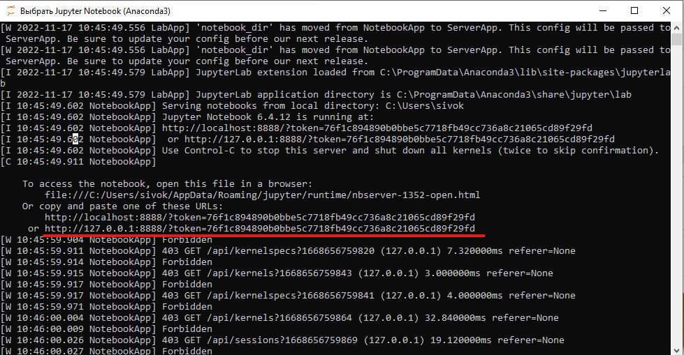
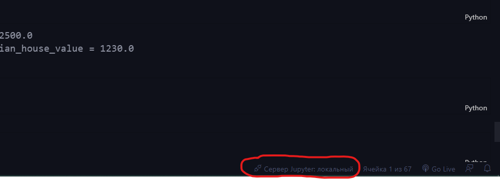
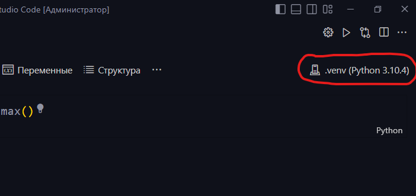

# Запуск Jupyter Notebook в виртуальной среде

## **1. Запуск терминала anaconda.**

## **2. Адрес сайта внизу "окна" взять из терминала anaconda (последняя строка с адресом http://):**

,

## **скопировать его и, нажав на строку внизу окна VSCode, вставить этот адрес:**

## **3. Активируем виртеальную среду в cmd терминале и пока не выходим из папки .venv**

## **4. Ctrl+Shift+P и выбираем Python из списка (ищем свой .venv)**

## **5. В правом верхнем углу окна VSCode выбираем этот Python:**

## **6. Выходим из каталога .venv и работаем**
